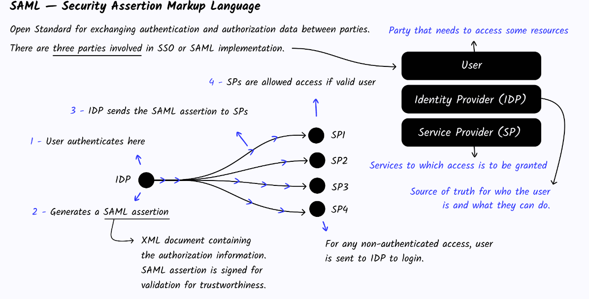

## SSO - Single Sign-On 
This is and strategy used to allow the users signin into only 1 service and getting access to all the services listed. An example of this is how google manage their services authentication, if you have you gmail account you have access to all the google services.

### HOW THE FLOW WORKS
First of all we need to know what SAML is. SAML (Securiy Assertion Markup Language) this is a open standar for exchanging authorization data between parties, so multiple parties can authenticate the user with only one login.
This image shows how this would work:

### CONCLUSION
The SSO is very useful when you have multiple services that have to have authenticated users but this strategy is hard to implement and the SAML configuration and setting is a complex topic, so if you don't want to have multiple services I recommend you to use the OAuth or the Cookie authentication