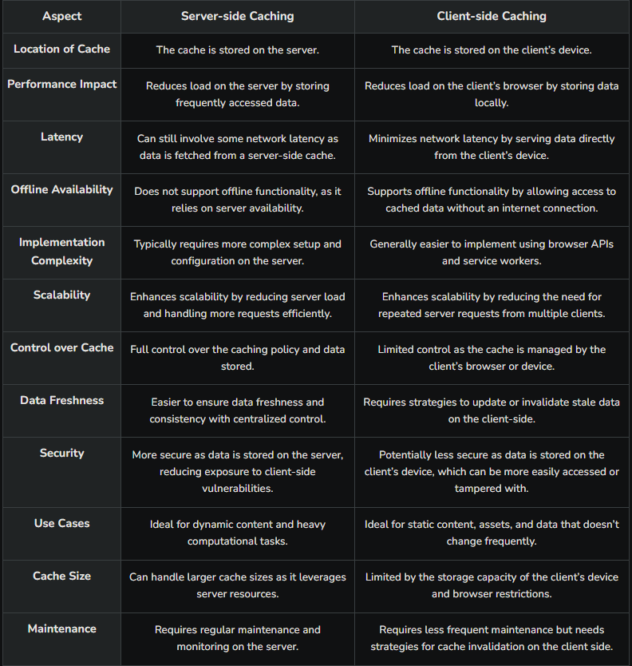
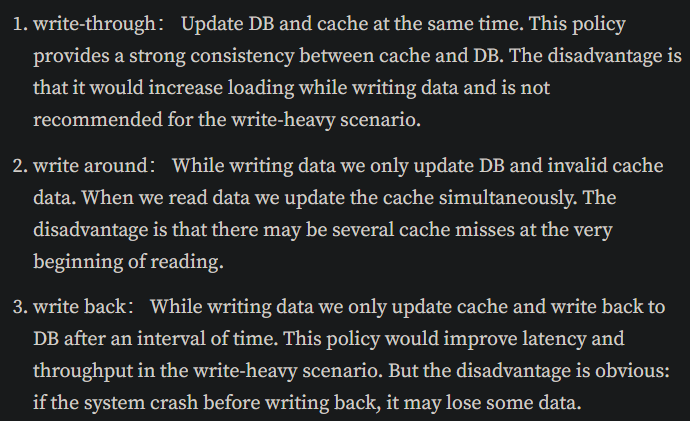

## What is data caching?
Data caching is have recurrent data of our application stored in some cache database for fast and easy access. The data chaching improves the performance of our website or application

### What are the data caching types?
There are 2 types of data caching, the server side and the client side. This is a table showing their differences:

URL: https://www.geeksforgeeks.org/server-side-caching-and-client-side-caching/
This shows that one type of caching is not better than the other, only shows that each type of caching the data has different objectives and advantages.

### Cache updated strategies
There are mainly 3 common used strategies when update the data.

URL: https://medium.com/@genchilu/cache-strategy-in-backend-d0baaacd2d79

#### Redis and the Server side caching
One of the popular cache databases for the server is Redis. Redis is a highly performance database that can be used to store cache thanks that use in-memory data structure saved as key/value pairs. This is useful especially to save data that is being currently requested by the client, this with the objective of shortening the response time.

#### CDNs and Client side caching
CDNs are commonly used to store image or videos that are shown to the client. This is useful especially because the time that requires to wait the server to respopnd with this type of data is huge. Moreover this type of caching allows the client to be offline and still be able to have the data.
