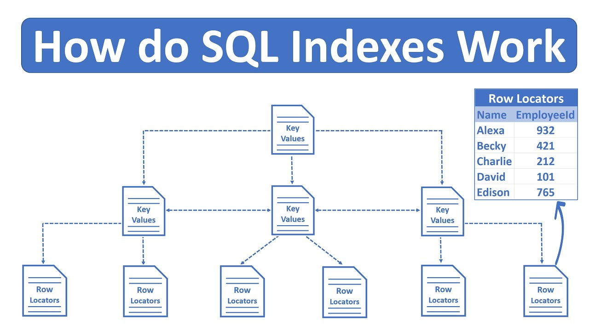
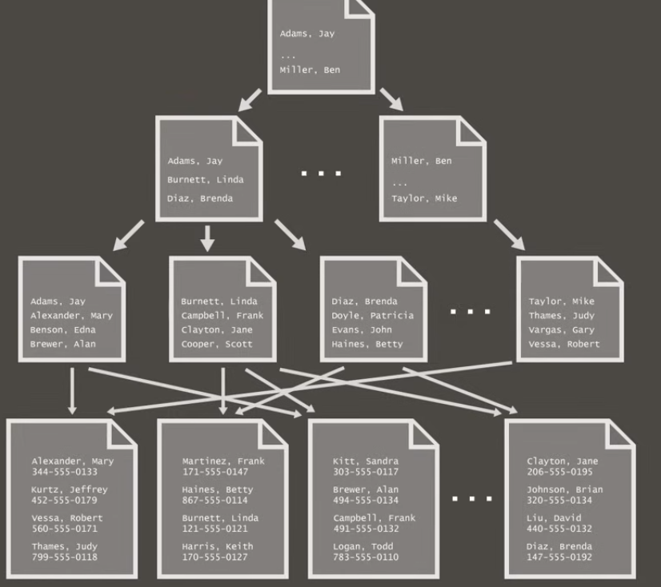

### MORE ABOUT DATABASES

#### ACID - Atomicity, consistency, isolation and durability
* **Atomicity**
  - Atomicity refers to the fact that the database transactions has to be finished completely or the DB has to be reverted to the same state
  - What is a transaction? A transaction is a single unit of work that can contain one query or multiple queries. If one query fail, the entire transaction fail
* **Consistency**
  - Consistency refers to ensure that the data has the correct state. The correct state is determined by the constraints that we declared. An example of this is for example if we define that one field cannot be null the database has to ensure that that field has never a null state
* **Isolation**
  - Isolation refers to the control of the concurrency. This means that if there are multiple same time queries the database has to treat this as sequential queries to verify in each query the consistency of the database.
* **Durability**
  - Refers to save transactions and data in a non volatile memory
Most or almost all the ORMs take charge of the ACID principle. For example Prisma, https://www.prisma.io/docs/orm/prisma-client/queries/transactions#read-modify-write.

#### N + 1 PROBLEM
The N + 1 problem appears when the app make a N number of queries being N a number that can change any time. To explain this come to see the next example:
  Imagine we have a users and a posts table, each user has a post related to him. To retrieve the user with his post our app make first a query to retrieve all the users, and then make for each user a query to the posts table looking for the post related to that user. This is called the N + 1 problem. Why? Because we have N querys that in this case represents the number of users plus 1 query to retrieve all the users.
How can we solve the N + 1 problem? Simply, that we can do is to do 2 simple querys, 1 for retrieving all the users, and one for retriving all the post. Then we can filter the posts manually with a **for of** for example.
Why the N + 1 problem is a problem? Think about an app that has a thousands of users if our app has to make a query for each user the latency and the resources consumed by our app will be enormous. In the other hand if we make it manually we will ever only have to do 2 queries.

#### DATABASE NORMALIZATION
There are five differents level of database normalization. Each level tell us differents resules that the database shoudl implement. The normalization rules are like statements that we have to follow to ensure our data integrity. Here are the five levels of normalization and their respective rules:
- First Normal Form (1NF):
  * Using row order to convey information is not permitted
  * Mixing datatypes in the same column is not permitted
  * Having a table withour primary key is not permitted
  * Repeating groups are not permitted
- Second Normal From (2NF)
  * Each non-key column attribute must depend on the entire primary key. For example if we have a table that have a primary key and a foreign key each column of that table must deppend on both of the keys
- Third Normal From (3NF)
  * Every non key column attribute must depend on the entire primary key, the whole key, and nothing but the key. this means that we cant have a non-key attribute that depends on other non-key attribute
- Fourth Normal From (4NF)
  * Multivalued dependencies in a table must be multivalued dependencies on the key. This means that if we have  multivalued dependencies this can be only related to the whole key of the table

### DATABASE INDEXES
Database indexes are a way to structure the data in your database that help some querys to be faster and more efficient. But, what are exactly database indexes? Well, for example we can define a particular column in one of our table to be the index of that table, the database itself will organize all the data to accept the an index search for that column. I will show an example of how a indexed table can be organized:

In this example we can see that we have key values (the column that we decide to be the index) that are hierarchy strucured. This makes it easy and faster to make a query because the database will not be obligated to make a scan to find the data that we want, only needs to search for that column in the index. This only if we are searching by the index that we declared, if we are searching by another column the database will have to do a full scan

#### TYPES OF INDEXES
There are many types of index, but now i will talk about two groups. In one hand we have the **clustered index**. This is an index where all the data is organized keeping the index order (like the phote above)

On the other hand we have **non-clustered** one. Contrary to the the clustered in this index all the data that is not the index is stored as normal data and the indexed points to the corresponding ones. This for example is useful if we want to have multiple indexes we can do it make it this type of index. The next is an example of a non-clustered index:

https://www.youtube.com/watch?v=ITcOiLSfVJQ - https://www.youtube.com/watch?v=-qNSXK7s7_w