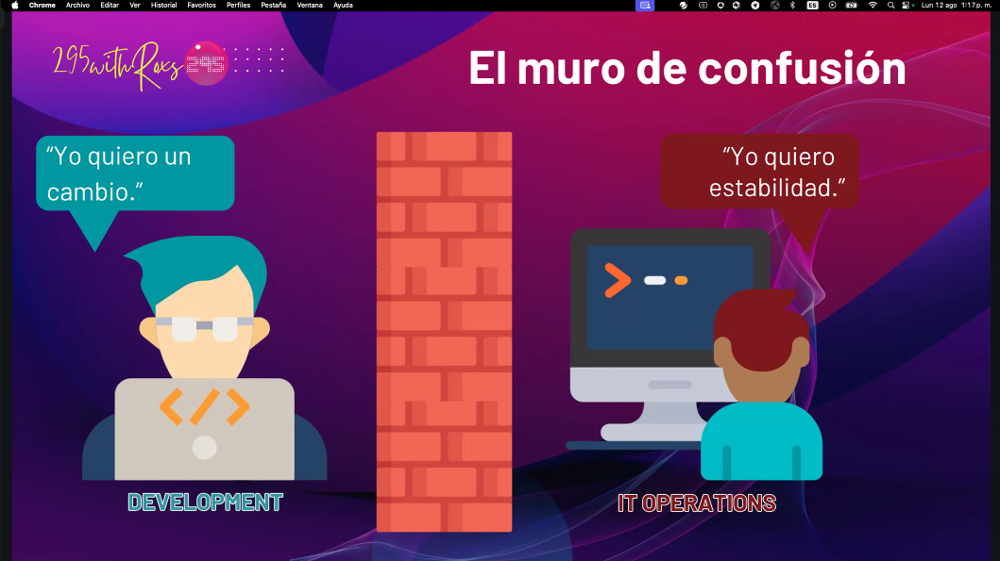
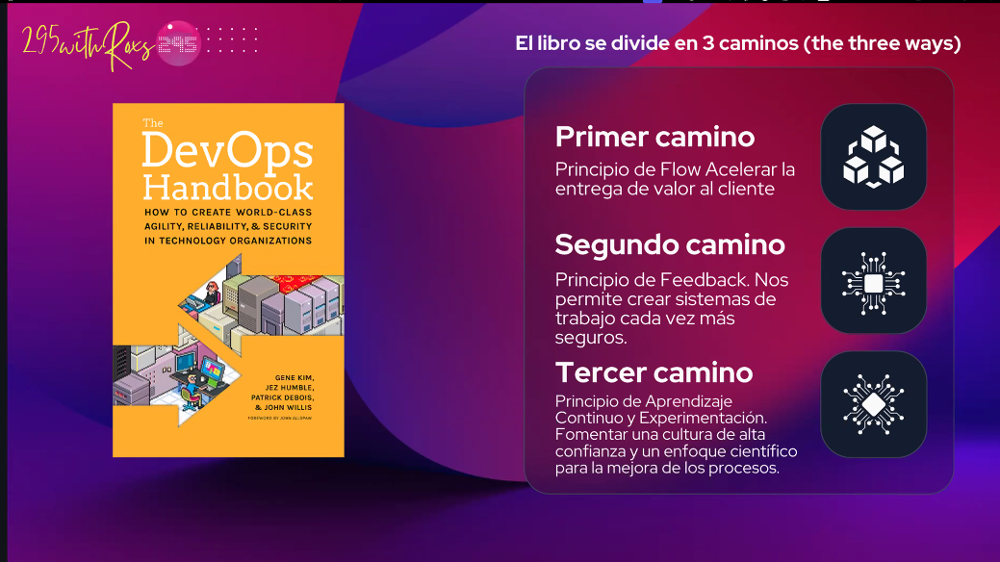
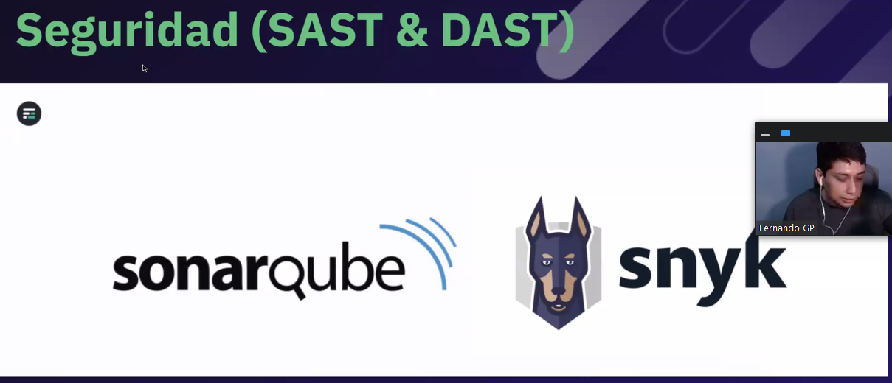
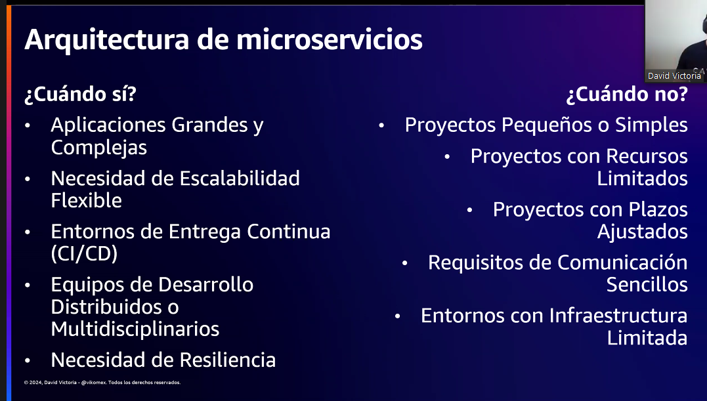
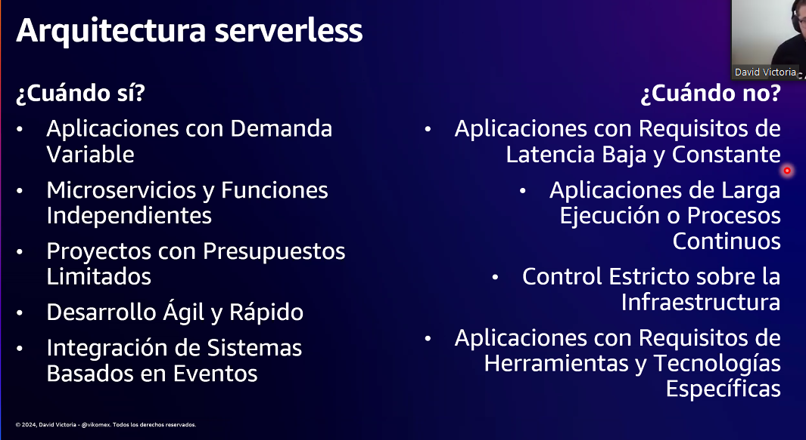

## DEVOPS DAY - CODIGO FACILITO
El devops es el que rompe con el muro de confusión entre dev y operations

### PRINCIPIOS DE DEVOPS

### HERRAMIENTAS
* Git flow
* Jenkins
* Son necesarios los test para el CI/CD