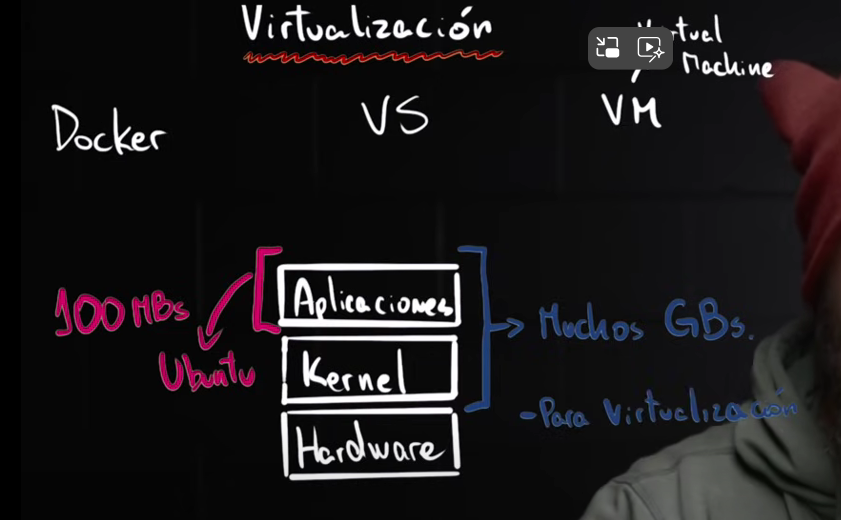

## DOCKER AND CONTAINERIZATION

Containerization is a way to pack all of our aplication with their configuration and dependencies. This make the containers to be protable and easy to share, this came to resolve the problem of sharing projects between differents machines.

####  WHERE THE CONTAINER IS SAVED?
There is one public and free container repository that is called docker-hub and works with nodejs, python, golang and a variety of other technologies

#### WHAT IS A DOCKER IMAGE?
A docker image is especifically the file where all the configuration, dependencies and code is located. This is the file that we want to share with the team. A container is like the sum of a list of different Docker images.

#### HOW DOCKER MAKE VIRTUALIZATION

Docker only virtualized the application layer and use the OS that is running. This make the docker image a lot smaller than the normal virtualization