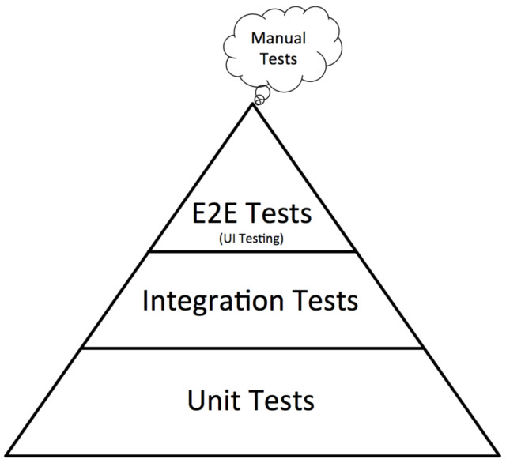
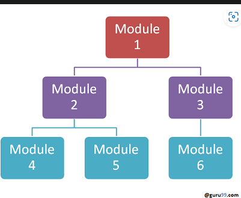

### TESTING
Testing can be separated by 3 levels in a kind of pyramid

https://www.browserstack.com/guide/testing-pyramid-for-test-automation

#### FIRST LEVEL - UNIT TESTING
The first level is the Unit Testing. Unit testing is for test isolated functionalities or components, this not test the work of this component with others this only works to test a single component in an isolated enviroment. Is essential to run several scenarios in the unit testing - happy path, error handling, etc.. Is recommended to practice the TDD (Test Driven Development) this means writes first the tests and then code the functionalities. BDD is another approach that is derived from the BDD, this focus in what the client expects to hapenn. A good tool for making Unit testing to node js app is JEST

#### SECOND LEVEL - INTEGRATION TESTING
The second leve is the Integration Testing. Integration testing test various modules as a group to see if they work well together. Although some module pass all the unit test, the module could also have some problems with comunnication with other modules. There are some approachs when doing integration testing: Big Bang approach, the developers wait until all the modules are complete to make the test. Incremental approach, the developers test the test while this are being developed, this can be done in a Top to Down approach where high modules are tested first and Down to Top approach where low modules are tested first. 

##### STUBS AND DRIVERS
For example if we want to do integration testgin of the module 2 but the modules 4 and 5 are not yet developer we  should use a stub to replace this modules and do the test as well. Viceverse the same can be applied with the drivers if we are having a Bottom to Top approach where for example a driver can replace the module 2 to test the module 4. It necessary to say that the Stubs and the Drivers dont contain the real logic of the module, only works as an input and output example.

#### THIRD LEVEL - E2E TEST
The philosofy of an E2E test is like a big integration test. We need all the app to be completely developer to make an E2E test, the objective of this type of test is to test all the app. This means that we have not to make any driver or stub (jest mocks)
#### BIBLIOGRAPHY LINKS
